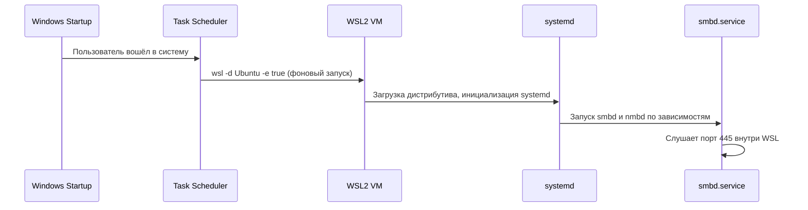

# 🏗️ Архитектура WSL2 Self-Hosted NAS

> 💡 **Назначение:** Данный документ описывает внутреннее взаимодействие компонентов, потоки данных и границы применимости решения. Решение спроектировано для домашнего использования, разработки и медиатеки. Оно не заменяет enterprise-NAS и не гарантирует аппаратную отказоустойчивость.

## 📐 Общая схема: 4 уровня взаимодействия

```
┌─────────────────────────────────────────┐
│ 4. КЛИЕНТЫ (Windows, macOS, TV, Phone)  │
│    • Подключаются по SMB://IP:445       │
│    • Аутентификация: пользователь/пароль│
└────────────┬────────────────────────────┘
             │ (сетевой пакет SMB)
             ▼
┌─────────────────────────────────────────┐
│ 3. СЕТЕВОЙ СЛОЙ (Windows Host)          │
│    • Виртуальный адаптер vEthernet (WSL)│
│    • NAT / localhost-forwarding         │
│    • Брандмауэр Windows                 │
│    • (опционально) netsh portproxy      │
└────────────┬────────────────────────────┘
             │ (перенаправление в WSL2)
             ▼
┌───────────────────────────────────────┐
│ 2. LINUX-СЛОЙ (WSL2 VM)               │
│    • Ядро Linux в лёгкой Hyper-V VM   │
│    • systemd → запускает smbd (Samba) │
│    • Файловая система: ext4 в .vhdx   │
│    • Пользователи/права: Linux UID/GID│
└────────────┬──────────────────────────┘
             │ (чтение/запись файлов)
             ▼
┌─────────────────────────────────────────────────────────────┐
│ 1. ФИЗИЧЕСКОЕ ХРАНИЛИЩЕ (Windows Disk)                      │
│    • Файл %USERPROFILE%\AppData\Local\Packages\...\ext4.vhdx│
│    • Реальные сектора на SSD/HDD                            │
└─────────────────────────────────────────────────────────────┘
```

---

## 🔗 1. Файловый ввод-вывод (I/O Path)

**Сценарий:** Пользователь копирует файл в `\\NAS\shared\file.mp4`


| Этап | Что происходит | Почему это важно |
|------|----------------|------------------|
| **SMB-запрос** | Клиент отправляет `CREATE file.mp4` с метаданными | Определяет кодировку имён, блокировки файлов, аутентификацию |
| **Аутентификация** | Samba сверяет логин/пароль с `smbpasswd` (не системным Linux!) | Позволяет использовать отдельные учётные данные для сети |
| **Маппинг прав** | Windows-пользователь `Alice` → Linux `alice` (UID 1000) | Несовпадение UID/GID → `Permission denied` |
| **9P vs ext4** | `/mnt/c/...` → протокол 9P (медленно). `/data` → нативный ext4 (быстро) | Разница в скорости до **5–10×** для мелких файлов |
| **Кэш записи** | Samba кэширует записи, WSL2 имеет собственный page cache | При внезапном отключении питания возможна потеря последних мегабайт |

---

## 🌐 2. Сетевая маршрутизация

WSL2 работает в изолированной подсети (`172.16–31.x`) за виртуальным NAT-адаптером. Доступ реализуется двумя способами:

### ✅ Вариант А: `localhost`-форвардинг (Win11 22H2+)
```
Клиент → 127.0.0.1:445 (Windows) 
       → vSwitch (Hyper-V) 
       → WSL2:172.x.x.x:445 
       → smbd
```
- **Плюсы:** Работает «из коробки», не требует прав администратора
- **Минусы:** Доступен **только с этого ПК**

### ✅ Вариант Б: `netsh portproxy` + LAN
```powershell
netsh interface portproxy add v4tov4 listenport=445 listenaddress=0.0.0.0 connectport=445 connectaddress=<WSL_IP>
```
```
Другой ПК в сети → 192.168.1.10:445 (хост) 
                 → portproxy 
                 → WSL_IP:445 
                 → smbd
```
- **Плюсы:** Полноценный доступ из локальной сети
- **Минусы:** Требует периодического обновления `connectaddress` при смене DHCP-аренды WSL

🔒 **Брандмауэр:** Правило должно быть привязано **только к профилю `Private`**. Открытие 445 в `Public` создаёт критическую уязвимость.

---

## ⚙️ 3. Жизненный цикл сервисов



| Компонент | Роль | Нюанс |
|-----------|------|-------|
| `/etc/wsl.conf` `[boot] systemd=true` | Включает `systemd` как PID 1 | Без него `systemctl enable smbd` не сработает |
| `wsl -d Ubuntu -e true` | «Будит» WSL без интерактивной сессии | Не блокирует вход, но запускает VM в фоне |
| Планировщик задач | Триггер: `При входе в систему` | Задержка **30 сек** даёт время инициализации сети Hyper-V |

---

## 🔐 4. Аутентификация: три независимых контекста

```
┌───────────────────────────────────────────────────┐
│ 1. Пользователь Windows                           │
│    • SID: S-1-5-21-...                            │
│    • Используется для входа в ОС                  │
├───────────────────────────────────────────────────┤
│ 2. Пользователь Linux (WSL)                       │
│    • UID/GID: 1000/1000                           │
│    • Владелец файлов в ext4                       │
├───────────────────────────────────────────────────┤
│ 3. Пользователь Samba                             │
│    • Хранится в /var/lib/samba/private/passdb.tdb │
│    • НЕ связан напрямую с Linux-паролем!          │
└───────────────────────────────────────────────────┘
```

⚠️ **Критическое правило:** Пароль для сетевого доступа задаётся **только** через `sudo smbpasswd -a $USER`. Ввод пароля Windows или Linux приведёт к `NT_STATUS_LOGON_FAILURE`.

---

## 💾 5. Хранение данных и ограничения

- **Физическое расположение:** `%USERPROFILE%\AppData\Local\Packages\CanonicalGroupLimited...\LocalState\ext4.vhdx`
- **Динамическое расширение:** `.vhdx` растёт по мере записи, но **не уменьшается автоматически** при удалении файлов.
- **Оптимизация:** `wsl --manage Ubuntu --compact` или `Optimize-VHD` в PowerShell.

### 🚦 Узкие места и архитектурные ограничения
| Проблема | Причина | Архитектурное решение |
|----------|---------|------------------------|
| Медленная запись мелких файлов | Данные в `/mnt/c/` (протокол 9P) | Хранить только в `/data` (ext4) |
| Не виден в сети | Брандмауэр / не обновлён portproxy | Правило `Private`, автозадача обновления IP |
| `Permission denied` | Права изменены через Windows-проводник | `force user = %S` в `smb.conf`, работа через Linux-shell |
| IP меняется после ребута | DHCP виртуальной сети Hyper-V | Скрипт `Update-WSLPortProxy.ps1` + Task Scheduler |
| Потеря данных при отключении | Page cache WSL2 + `sync always = no` | Регулярные бэкапы, ИБП, `sync` при критичных операциях |

---

## 📚 Связанные документы
- 🌐 [Настройка сети, PortProxy и Брандмауэра](networking.md)
- 🔒 [Безопасность, права и аутентификация](security.md)
- 💾 [Стратегии бэкапа и обслуживание VHDX](backup.md)
- 🚦 [Устранение неполадок](../README.md#🛠️-устранение-проблем)

---
📝 *Документ обновлён: 2026-04-21 | Совместимо с WSL2 + Ubuntu 22.04/24.04 + Samba 4.15+*
```